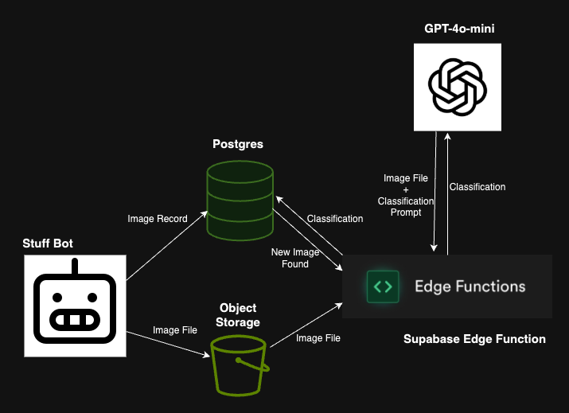
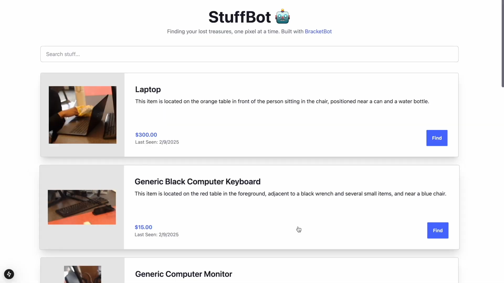

## Stuff Bot
Stuff Bot is a robot, built on the [Bracket Bot Platform](https://bracket.bot), which roams around and catalogues your stuff.

Items are detected by YOLOv8, and classified by GPT-4o-mini. Classified items are viewable in a web interface.

[Check out the demo video here](https://www.youtube.com/watch?v=0qOSO2aDou0)

Built by Andrew and Ross Melbourne at the Bracket Bot Hackathon in Kitchner, Ontario. Feburary 2025.

## Architecture

## Web Interface

